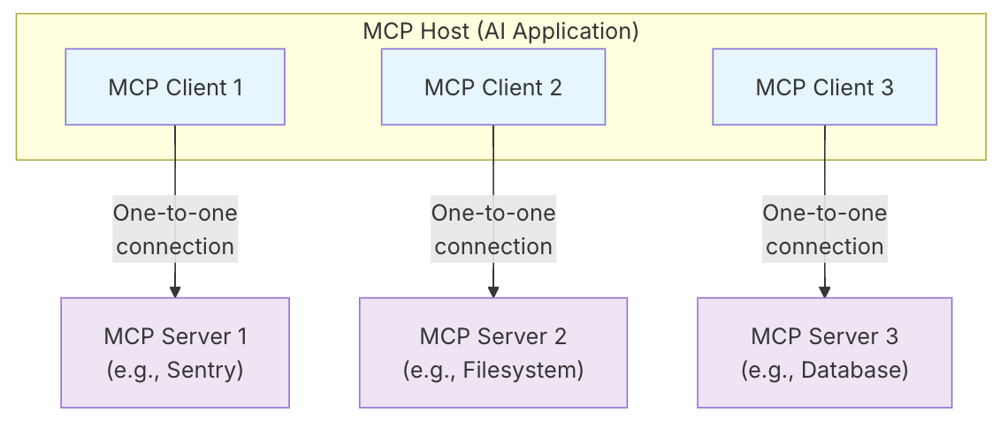

# Description
MCP 全名為「Model Context Protocol」，MCP 最早由 Anthropic 於 2024 年底提出，後續 OpenAI、Google 也加入支援 MCP 協定。因此，現今談到讓 AI 應用程式對接工具時，MCP 是業界首要提及的標準協定。

## MCP 組成

1. MCP Host: 
    - The <b>AI application</b> that coordinates and <u>manages one or multiple MCP clients</u>
    - e.g. Cursor IDE, Claude Code, Claude Desktop, Cline, Cherry Studio…
    - 本質上就是支援 MCP 協議的軟體

2. MCP Client: 
    - A component that maintains a connection to an MCP server and obtains context from an MCP server for the MCP host to use

3. MCP Server: 
    - A <b>program</b> that provides context to MCP clients
    - MCP server 是指提供上下文資料的程式，所以不去管它在哪裡執行。可以在本地也可以遠端執行。
        - 例如，當 Claude Desktop 啟動 filesystem server 時，該 server 在同一台機器上本地執行，因為它使用 STDIO transport。這通常稱為「local」MCP server。
        - 官方的 Sentry MCP server 在 Sentry 平台上執行，並使用 Streamable HTTP transport。這通常稱為「remote」MCP server。
        - 原本還有 SSE（Server-Sent Events），SSE 在 2025 年 3 月底已被 MCP 官方棄用，官方現在主要推薦使用 Streamable HTTP。
    - 一個 MCP server 可以包含多個 tool (或 function)

## 注意事項
- 當 MCP Host (e.g. Cline…) 主動安裝或在對應的市場上點擊安裝 MCP server，通常都是模型主導整個安裝過程，一般來說就是模型去看 Github repo 的安裝說明，然後進行安裝，所以如果不放心給於權限，可以自己透過設定來安裝，可參考此[來源](https://youtu.be/yjBUnbRgiNs?t=563)

# Reference
- https://www.explainthis.io/zh-hant/ai/cursor-guide/4-1-before-mcp
- https://www.explainthis.io/zh-hant/ai/cursor-guide/4-3-using-mcp-in-cursor
- https://modelcontextprotocol.io/docs/learn/architecture
- https://www.youtube.com/watch?v=yjBUnbRgiNs
