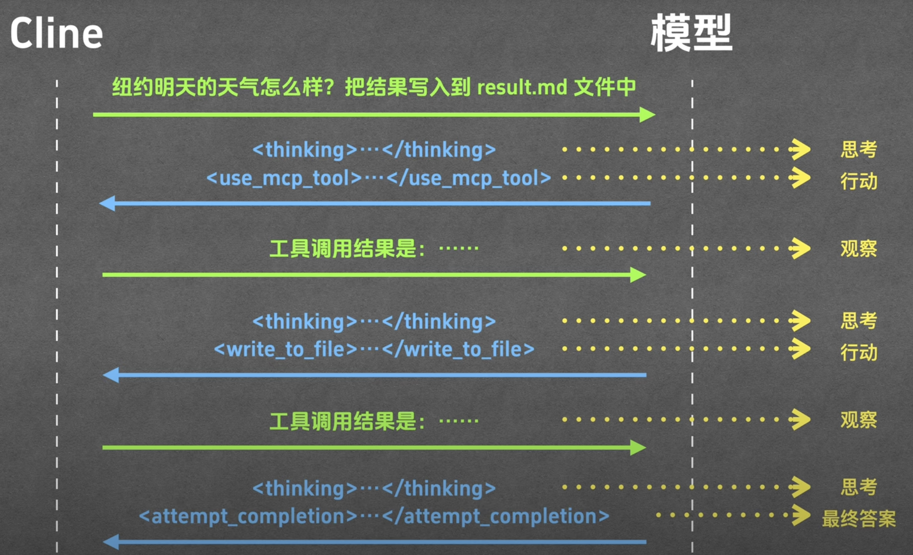
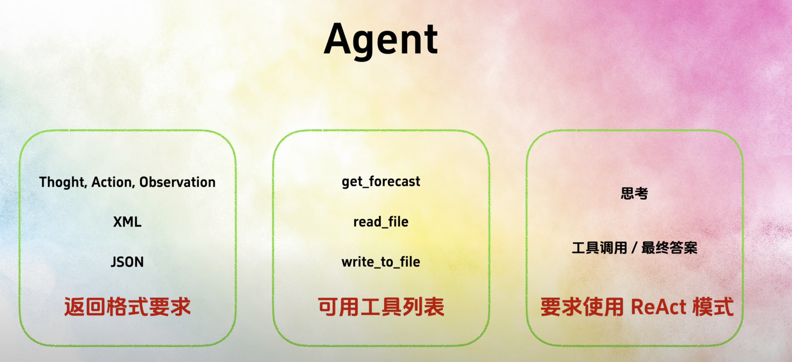

# 擷取 Cline 與 LLM 的互動用的服務
### 設計架構

### 實際上發生的狀況，因為是 SSE 範例，所以 LLM 回覆會是 stream 的，不會一次完成

# 檔案說明
- llm_logger.py: 負責記錄 Cline 與 LLM 之間的互動。
- llm_log_1_hello.log: 這是紀錄 Cline 與 LLM 互動的詳細資訊，這個範例只是打了一個 hello 的招呼。
- llm_log_2_use_mcp.log: 這是紀錄 Cline 與 LLM 互動的詳細資訊，這個範例是請求天氣預告，並看到有使用 mcp server。
- system_prompt.md: 這是從 log 中萃取出來並 format 後， Cline 傳給 LLM 的 system prompt。
- llm_response_use_mcp.xml: 這是從 log 中萃取出來並 format 後，這是 LLM 使用 mcp server 的回應內容。

# 值得注意的部分
## Cline --> LLM
  - 請求的時候，message 會分多個 role (system, user, assistant...)，也會帶著其他參數 (temperature, stream...)
  - system 的 content 非常重要，這是 Cline 傳給 LLM 的 system prompt，檔案 system_prompt.md 就是從 log 中萃取出來並 format 後的內容
    - 重複的告訴 LLM 利用 `<thinking>` 標籤來思考
    - Tool Use Formatting 定義如何使用各種工具
    - Tools 段落列出的 read_file, write_to_file, replace_in_file 等等，都是為 Cline 定義好的 Tools
    - use_mcp_tool 定義如何使用 MCP tool，格式要怎麼帶
    - Connected MCP Servers 段落給出目前有的 mcp servers 和其對應有哪些 tools 與使用規範
    - 使用 `attempt_completion` 當作為任務處理完成的標籤(從 system prompt 可以看出 Cline 他也只是把它當作一個 tools)
  - 第二次互動，注意會多了 role = assistant ，把上次的回答帶過去，包含一些歷史訊息

## LLM --> Cline
- `:` - > 冒號開頭表示註解。通常，伺服器每隔一段時間就會向瀏覽器發送一個註釋，保持連線不中斷。
- content 裡面的就是 LLM 的回答，會和 Cline 介面上的顯示一致
- 會依據 Cline 提供的方法 (xml 格式 - `<use_mcp_tool>`) 來回覆 Cline，告知 Cline 要調用哪個 MCP tool
  - 細節可以參考 llm_response_use_mcp.xml

## 檢視整個對話流程
  

## 如同 system prompt 提到的，細節上每次回覆其實都會帶著 `<thinking>` 標籤 
  

## 用到了 ReAct 概念

## Agent 

# Reference： 
- Youtube:
    - [番外篇：Cline 與 LLM 的互動](https://www.youtube.com/watch?v=YyVkXrXxvX8)
- [Github Repo](https://github.com/MarkTechStation/VideoCode/tree/main/MCP%E7%BB%88%E6%9E%81%E6%8C%87%E5%8D%97-%E7%95%AA%E5%A4%96%E7%AF%87)