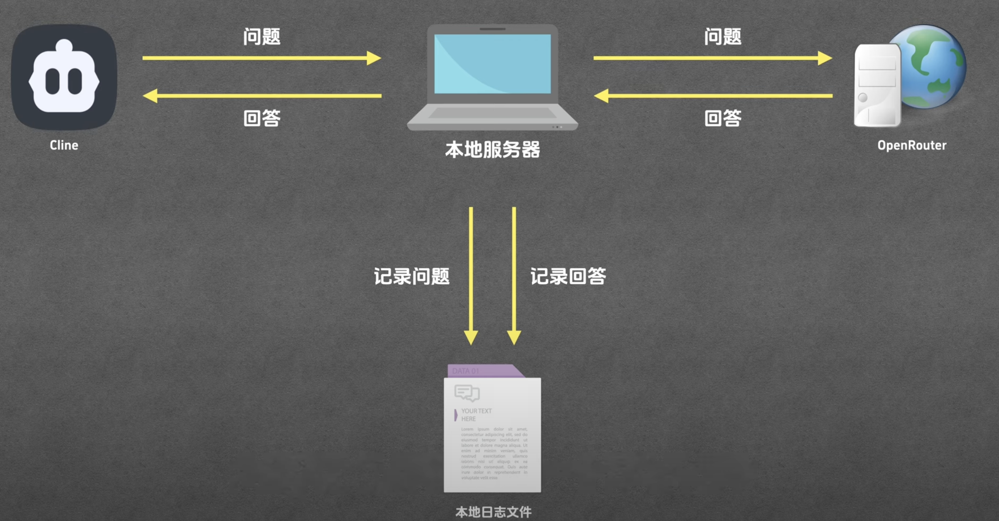
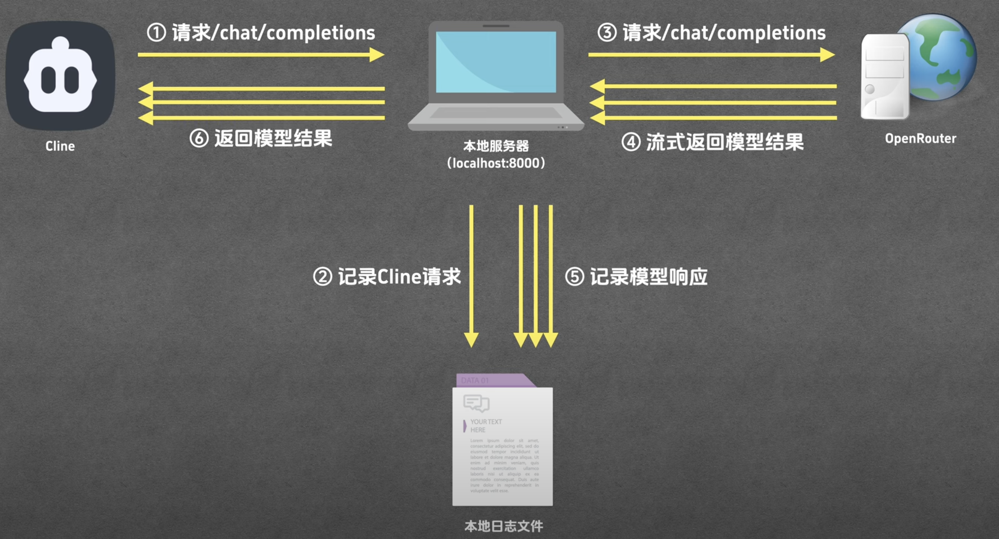
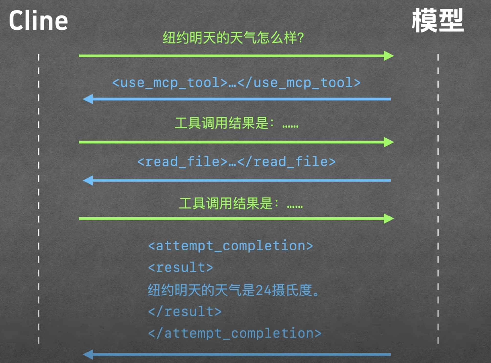
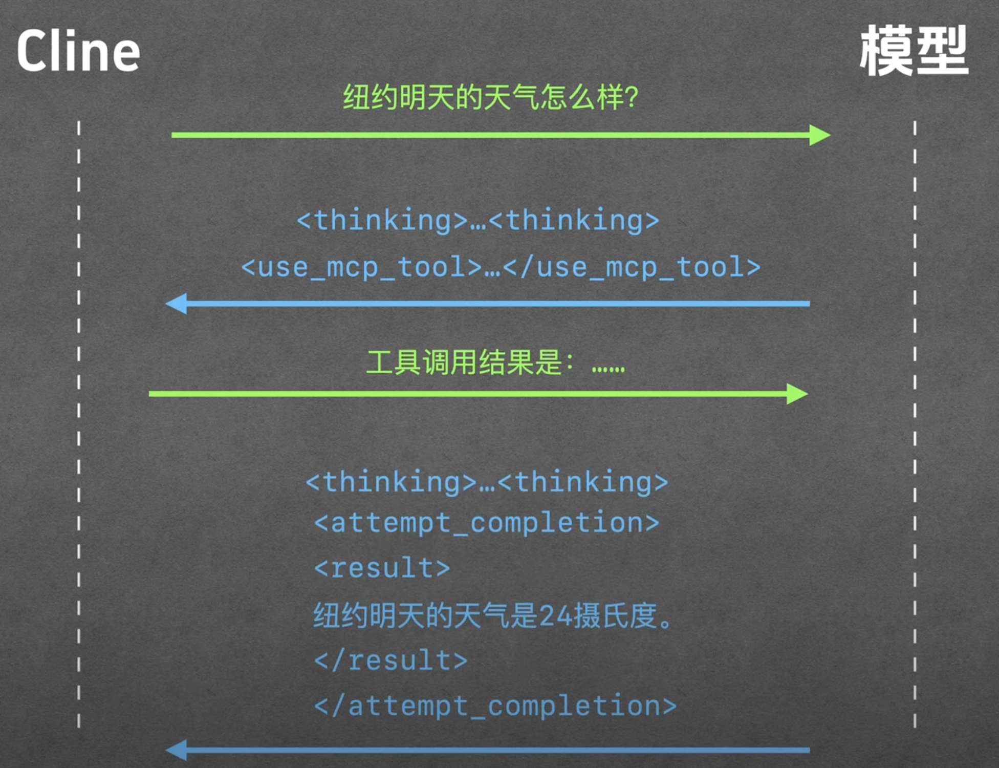

# 擷取 Cline 與 LLM 的互動用的服務

# 值得注意的部分
## Cline --> LLM 
- 提供 system prompt, tool use formatting 這邊會去定義
- 值得注意 use_mcp_tool, attempt_completion
  
- Cline 會透過 < thinking > 標籤來告訴 LLM 記得要先思考 
  

- 第二次互動，注意會多了 role = assistant ，把上次的回答帶過去，包含一些歷史訊息

## LLM --> Cline
- : 冒號開頭表示註解。通常，伺服器每隔一段時間就會向瀏覽器發送一個註釋，保持連線不中斷。
- content 裡面的就是 LLM 的回答，會和 Cline 介面上的顯示一致
- 會依據 Cline 提供的方法 (xml 格式 - < use_mcp_tool >) 來回覆 Cline，告知 Cline 要調用哪個 MCP tool

# Reference： 
- Youtube:
    - [番外篇：Cline 與 LLM 的互動](https://www.youtube.com/watch?v=YyVkXrXxvX8)
- [Github Repo](https://github.com/MarkTechStation/VideoCode/tree/main/MCP%E7%BB%88%E6%9E%81%E6%8C%87%E5%8D%97-%E7%95%AA%E5%A4%96%E7%AF%87)