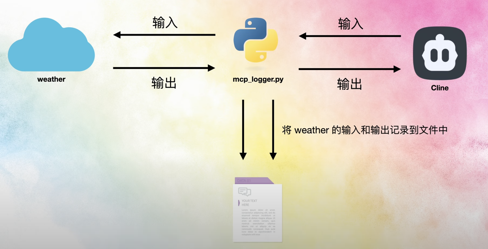
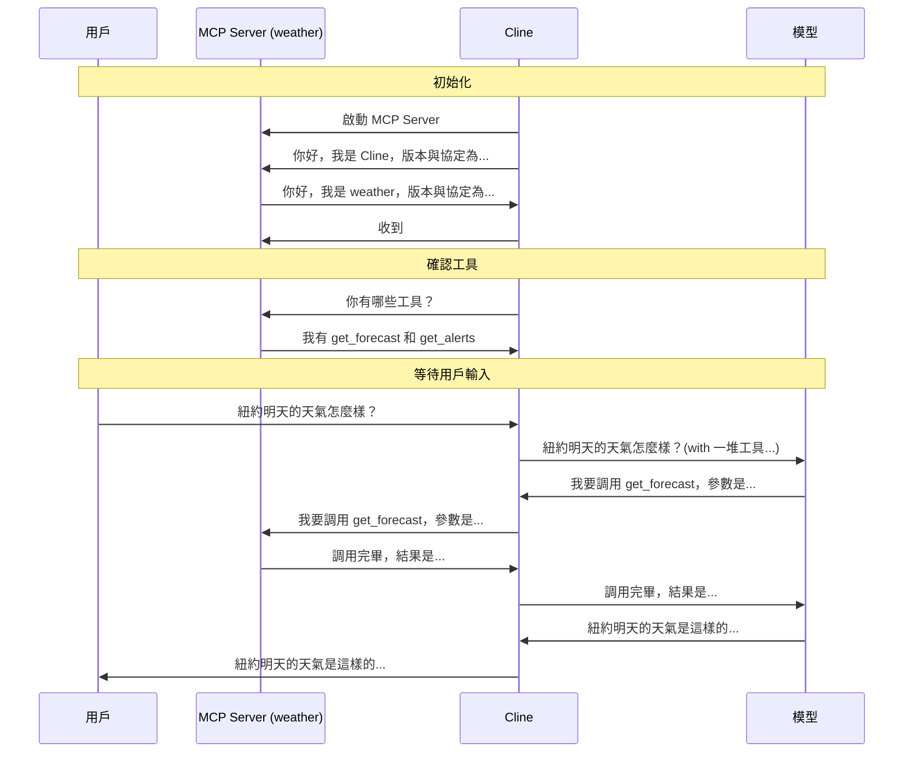

# Weather MCP Server
- weather.py：一個範例 MCP Server，可用於天氣預報和天氣警報，程式碼主要來自 MCP 官方範例。
- mcp_logger.py：用於擷取記錄 MCP Server 的輸入輸出，並將記錄內容寫入 mcp_io.log，該程式碼主要由 Gemini 2.5 Pro 編寫。


## 用 mcp_logger.py 擷取 MCP Server 的輸入輸出
概念上就是跑   
```bash
python mcp_logger.py uv run /path/weather.py 
```


mcp_io.log (留一個紀錄於 mcp_io_learn.txt) 
- 溝通為 json {} 形式
- 輸入: Cline -> MCP Server
- 輸出: MCP Server -> Cline

## MCP Server - Cline - LLM 互動



# Reference： 
- Youtube:
    - [基礎篇：使用 MCP + 簡介流程](https://www.youtube.com/watch?v=yjBUnbRgiNs)
    - [進階篇：動手寫一個 MCP Server + 分析底層協議](https://www.youtube.com/watch?v=zrs_HWkZS5w)
- [Github Repo](https://github.com/MarkTechStation/VideoCode/tree/main/MCP%E7%BB%88%E6%9E%81%E6%8C%87%E5%8D%97-%E8%BF%9B%E9%98%B6%E7%AF%87/weather)
- [MCP Server 官方文件](https://modelcontextprotocol.io/quickstart/server)